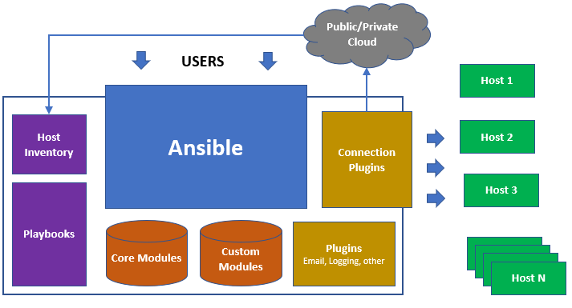
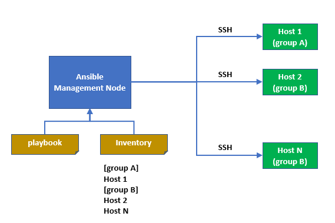

# DevOps: InfraAsCode (IaC) with Ansible

## Ansible Flow



## Introduction

## 1. Purpose

- This is a tutorial setup the environment and deploy application for Webservice Project of Sun* Inc.
- In this guide we will instroduce:
  - How to setup environment, deploy application using automation tools such as Ansible.

## 2. Objectives and application range

- **Types of programming languages**
  - [x] Ruby
  - [x] PHP
  - [x] NodeJS, NextJS

- **Operation system (OS)**
  - [x] Ubuntu 20.04

- **Environment configuration**
  - [x] Develop
  - [x] Staging
  - [x] Production

## Ansible structure

## 1. What is Ansible

- Ansible is an open-source software provisioning, configuration management, and application-deployment tool enabling infrastructure as code.
- It runs on many Unix-like systems, and can configure both Unix-like systems as well as Microsoft Windows. It includes its own declarative language to describe system configuration.
- Ansible documentation: <https://docs.ansible.com/>

## 2. Directory layout

```bash
├── group_vars
│   ├── all
│   ├── tag_Env_dev
│   ├── tag_Env_stg
│   ├── tag_Env_prod
│   ├── tag_Role_php
│   ├── tag_Role_ruby
│   └── tag_Role_node
├── inventory
│   └── develop
│   └── staging
│   └── production
├── roles
│   └── base
│   └── ssh-users
│   └── ...
├── ansible.cfg
├── playbook-php.yml
├── playbook-ruby.yml
└── playbook-node.yml
```

## 3. Directory detail

### 3.1 Group_vars

- Varialbes of environments using on playbook
  - [x] all : All variables common using all roles on ansible & all env
  - [x] tag_Env_dev: All variables using for only develop env
  - [x] tag_Env_stg: All variables using for only staging env
  - [x] tag_Env_prod: All variables using for only production env
  - [x] tag_Role_ruby: variables for ruby project
  - [x] tag_Role_php: variables for php project
  - [x] tag_Role_node: variables for nodejs project

### 3.2 Invertory

- Inventory have 3 list of host:
  - [x] develop
  - [x] staging
  - [x] production

- Inventory structure (Example: inventory/develop)

  ```bash
  [tag_Role_ruby]
  ruby_host_ip # Replace host ip ruby server

  [tag_Role_php]
  php_host_ip  # Replace host ip php server

  [tag_Role_node]
  node_host_ip  # Replace host ip php server

  [tag_Env_dev:children]
  tag_Role_php
  tag_Role_ruby
  tag_Role_node
  ```

### 3.3 Roles

  ```bash
  - base
  - aws-cli
  - hostname
  - distribute-key
  - ssh-user
  - ruby-with-rvm
  - rails-with-rvm
  - puma-with-rvm
  - nginx
  - npm-ppa
  - yarn-ppa
  - mysql-server
  - mysql-client
  - redis
  - logrotate
  ```

### 3.4 Playbook

- Running playbook to install with your programming languages:
  - [x] playbook-php.yml
  - [x] playbook-ruby.yml
  - [x] playbook-node.yml

## Install Ansible & Config SSH

## 1. Install Ansible

- Install the repository & install  ansible package:

  ```bash
  sudo apt-get install software-properties-common
  sudo apt-add-repository --yes --update ppa:ansible/ansible
  sudo apt-get update
  sudo apt-get install ansible
  ```

## 2. Config ssh to server

- Add to ~/.ssh/config on PC running Ansible

  ```bash
  Host [Host_Name]
    HostName [Host_IP]
    User [User_Name]
    Port 22
    IdentityFile <path to ssh private key>
  ```

- Add to /etc/sudoers in inventory server

  ```bash
  [User_Name]  ALL=(ALL)  NOPASSWD: ALL
  ```

## Setup environment for Projects



## 1. Setup environment for project

### 1.1 Update group_vars

- all (**group_vars/all/main.yml**): Contains variables of shared roles, change the version you desire, the default is:
  - project: "suncd" # Change project name
  - deploy_user: deploy

- tag_Env_dev (**group_vars/tag_Env_dev/main.yml**):
  - env: dev
  - full_env: development

- tag_Env_stg (**group_vars/tag_Env_stg/main.yml**):
  - env: stg
  - full_env: staging

- tag_Env_prod (**group_vars/tag_Env_prod/main.yml**):
  - env: prod
  - full_env: production

- Variable common for dev,stg & prod
  - BASIC_AUTH_USERNAME: ""
  - BASIC_AUTH_PASSWORD: ""
  - APP_DB_NAME: ""
  - APP_DB_USER: ""
  - APP_DB_PASSWORD: ""

- tag_Env_php (**group_vars/tag_Role_php/main.yml**)
  - type: php
  - server_unix: /var/run/php/php{{ php_version }}-fpm.sock
  - app_path_project: /var/www/{{ project }}
  - php_version: 7.4
  - php_repo: ppa:ondrej/php

- tag_Env_ruby (**group_vars/tag_Role_ruby/main.yml**)
  - type: ruby
  - app_path: /usr/local/rails_app/
  - app_path_project: "{{ app_path }}{{ project }}"
  - server_unix: //{{ app_path_project }}/shared/tmp/sockets/puma.sock

- tag_Env_node (**group_vars/tag_Role_node/main.yml**)
  - type: node
  - app_path_project: /var/www/{{ project }}
  - proxy_port: 8000

### 1.2 Update inventory

- Update inventory host corresponding, Example: Running playbook-php.yml

  ```bash
  [tag_Role_php]
  IP_PHP_Host < Change host here

  [tag_Env_php:children]
  tag_Role_php
  ```

### 1.3 Update roles using for playbook-ruby.yml

- playbook-php.yml
  - [x] base
  - [x] aws-cli
  - [x] hostname
  - [x] distribute-key
  - [x] nginx
  - [x] php-fpm
  - [x] npm-ppa
  - [x] yarn-ppa
  - [x] redis
  - [x] mysql-server
  - [x] mysql-client
  - [x] logrotate

- playbook-ruby.yml
  - [x] base
  - [x] aws-cli
  - [x] hostname
  - [x] distribute-key
  - [x] ruby-with-rvm
  - [x] rails-with-rvm
  - [x] puma-with-rvm
  - [x] nginx
  - [x] npm-ppa
  - [x] yarn-ppa
  - [x] redis
  - [x] mysql-server
  - [x] mysql-client
  - [x] logrotate

- playbook-node.yml
  - [x] base
  - [x] aws-cli
  - [x] hostname
  - [x] distribute-key
  - [x] nginx
  - [x] redis
  - [x] npm-ppa
  - [x] yarn-ppa
  - [x] pm2-ppa
  - [x] mysql-server
  - [x] mysql-client
  - [x] logrotate

### 1.4 Default variables

|   Name   |    Variable    |   Value    |                Path                | Line |
|----------|----------------|------------|------------------------------------|------|
| Project  | project        | suncd      | group_vars/all/main.yml            |  2   |
| Timezone | timezone       | Asia/Tokyo | roles/base/vars/main.yml           |  2   |
| PHP-FPM  | php_version    | 7.4        | group_vars/tag_Role_php/main.yml   |  8   |
| Redis    | redis_version  | 6.2.0      | roles/redis/vars/main.yml          |  3   |
| NodeJS   | nodejs_version | 14         | roles/npm-ppa/vars/main.yml        |  2   |
| Yarn     | yarn_version   | 1.12.3     | roles/yarn-ppa/vars/main.yml       |  2   |
| Bundle   | bundle_version | 2.0.2      | roles/ruby-with-rvm/vars/main.yml  |  5   |
| Ruby     | ruby_version   | 2.6.3      | roles/ruby-with-rvm/vars/main.yml  |  20  |
| Rails    | rails_version  | 6.0.1      | roles/rails-with-rvm/vars/main.yml |  2   |
| Puma     | puma_version   | 4.3.1      | roles/puma-with-rvm/vars/main.yml  |  2   |
| PM2      | pm2_version    | 5.1.0      | roles/pm2-ppa/vars/main.yml        |  2   |

## 2. Running playbook

### 2.1 Validate playbook before running

  ```bash
  ansible-playbook -D playbook-php.yml --check --diff
  ansible-playbook -D playbook-ruby.yml --check --diff
  ansible-playbook -D playbook-node.yml --check --diff
  ```

### 2.2 Running playbook to install (Example: develop enviroment)

  ```bash
  ansible-playbook -i inventory/develop playbook-php.yml
  ansible-playbook -i inventory/develop playbook-ruby.yml
  ansible-playbook -i inventory/develop playbook-node.yml
  ```

## Release

- **Date**: 26/11/2021
- **SupportTeam**: [Infra] IaC & CI/CD Research :star:
